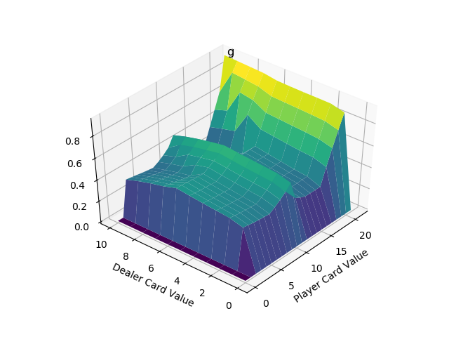
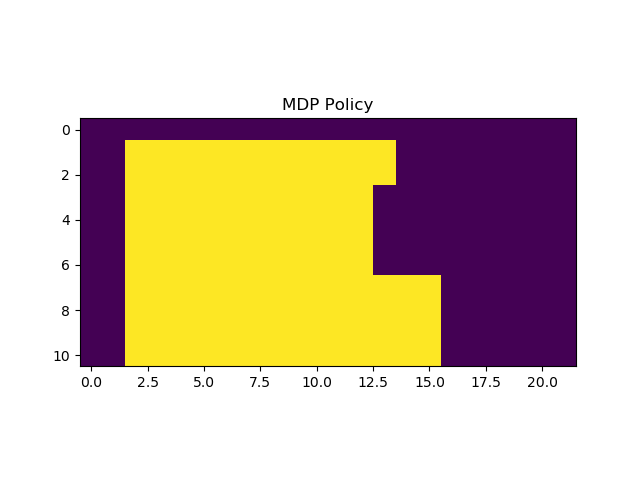
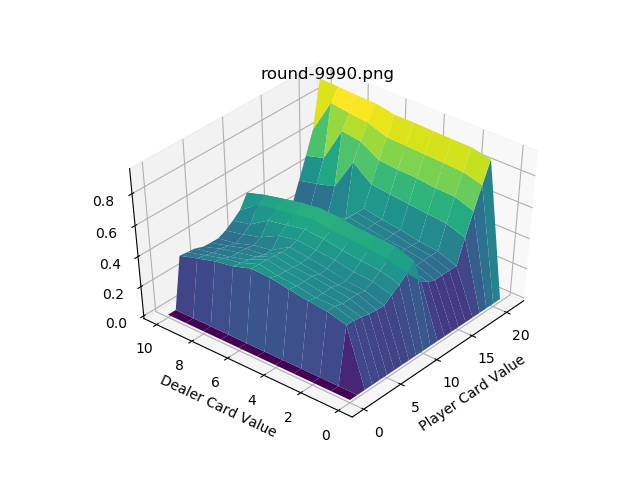
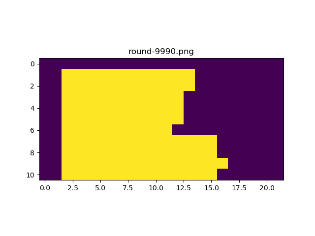
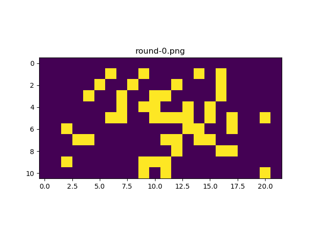
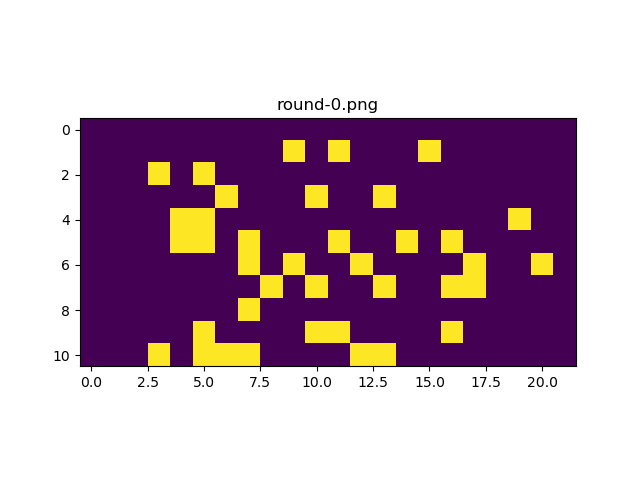
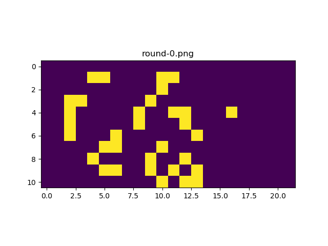

# Easy21
## Usage
Install required packages by running 
    `pip install -r requirements.txt`  
To use Markov Decision Process and Monte Carlo to estimate state action value function, run 
    `python Markov_Decision_Process.py`  
To use Monte Carlo Control to estimate state action value function, run 
    `python Monte_Carlo_Control.py`  

## Results
Algorithm|State-Action Value Function | Policy (yellow - hit, purple - stay) 
-----------:|:-------------------------:|:-------------------------:
Markov Decision Process||    |  
Monte Carlo Control (Linearly Decreasing Epsilon) || 

### Evolution of Monte Carlo Control
Algorithm|State-Action Value Function | Policy (yellow - hit, purple - stay) 
-----------:|:-------------------------:|:-------------------------:
Epsilon = 0 ||    |  
Epsilon = 1|| 
Linearly Decreasing Epsilon || 
## Discussion
A complete description of the project: https://github.com/XingyuHe/Easy21/blob/master/ProjectMath.pdf

